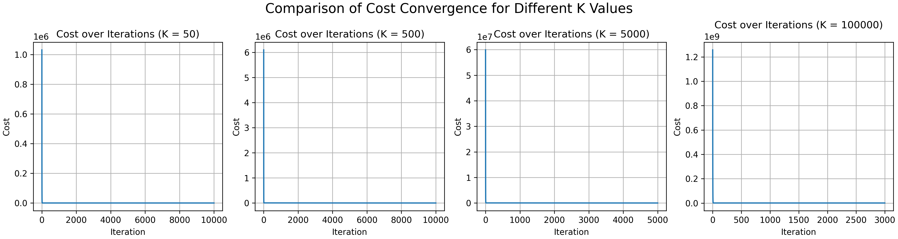
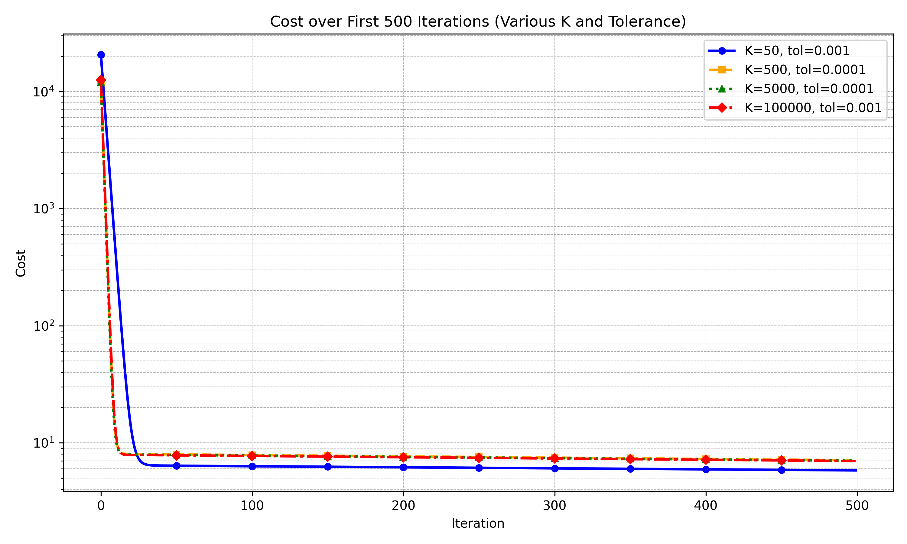
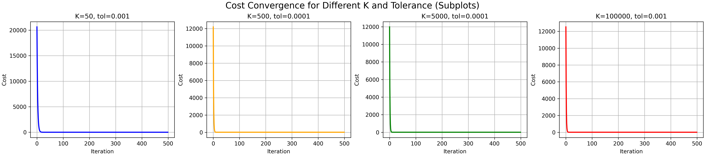
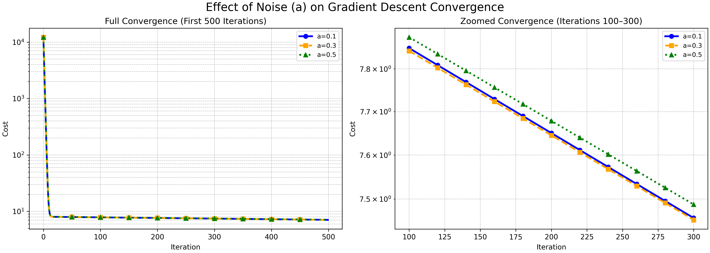

# Gradient Descent Analysis 

---

##  Introduction
This project focuses on implementing and analyzing the **Gradient Descent** algorithm for estimating the parameters of a linear model.  
The experiments investigate how several factors influence convergence, including:

- Number of samples (K)
- Noise level (a)
- Learning rate (α)
- Tolerance
- Number of iterations

Python was used along with the following libraries:

- **NumPy** – numerical computations  
- **Matplotlib** – visualization  
- **Math** – numerical formatting  

---

#  Step 1 — Sample Generation & Basic Gradient Descent

We generate synthetic data based on:

\[
y = mx + b + \text{noise}
\]

with true parameters:

- **m = 8**
- **b = 4**
- **noise ∼ N(0, 0.1)**

A standard Gradient Descent algorithm is implemented to learn parameters \(m\) and \(b\).

### 🔹 Cost Reduction (Start & End of Training)

### 🔹 Data & Model Comparison

The model successfully converges to the true parameter values when an appropriate learning rate and enough iterations are used.

---

# Step 2 — Effect of Number of Samples (K) & Tolerance

We test four dataset sizes:
K = 50, 500, 5000, 100000

Each setting includes a tuned learning rate and tolerance.

---

### 🔹 Cost Convergence Over All Iterations

---

### 🔹 First 500 Iterations (Log Scale)

---

### 🔹 Subplot Comparison

---

### ✔ Key Findings
- Larger **K** → more stable convergence  
- Larger datasets → smaller learning rate needed  
- Higher K improves final error but increases training time  

---

#  Step 3 — Effect of Noise Level (a)

We evaluate:

a = 0.1, 0.3, 0.5

with fixed:

K = 500

---

### 🔹 Full Convergence & Zoomed Plot

---

### ✔ Observations
- Larger noise → higher starting cost  
- Convergence becomes slower and less stable  
- Differences are most visible between iterations 100–300  

---

#  Step 4 — Conceptual Interpretation

The final question:  
 *Which factor has the greatest impact on accurate parameter estimation?*

### ✔ Correct Answer: **Learning Rate (α)**

- Too large → divergence  
- Too small → extremely slow convergence  

Thus, proper tuning of α is the most critical part of Gradient Descent.

---

#  Final Conclusion

This project demonstrates:

- Full implementation of Gradient Descent  
- Influence of dataset size, noise, tolerance, and learning rate  
- Visual comparison of convergence behaviors  

Despite multiple contributing factors, **learning rate** is the key element determining whether Gradient Descent succeeds or fails.

---

